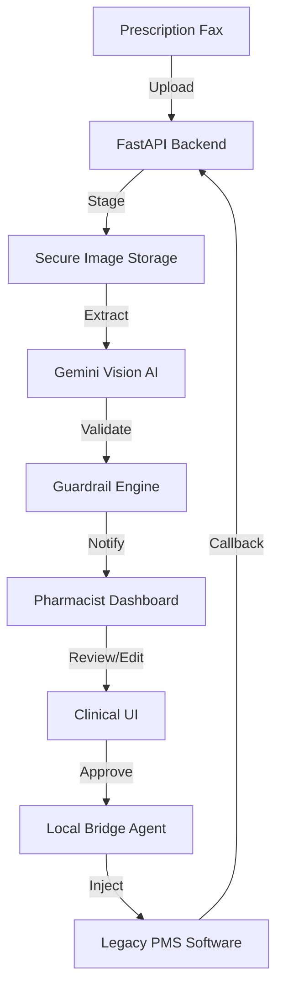

# Med-Parser: Pharmaceutical Clinical Automation

**Med-Parser** is a secure, professional-grade pharmacy automation platform designed to bridge the gap between paper-based clinical workflows and legacy Pharmacy Management Systems (PMS). By leveraging Google Gemini Vision AI and a specialized RPA Bridge Agent, Med-Parser digitizes prescription faxes and injects verified data directly into target software with zero manual transcription.

---

## 🧩 The Core Problem
Pharmacists spend hours manually transcribing handwritten or faxed prescriptions into legacy systems, a process prone to human error and fatigue. **Med-Parser** solves this by:
1.  **Extracting**: Using Vision AI to digitize unstructured clinical images.
2.  **Verifying**: Providing a high-fidelity dashboard for Human-in-the-Loop (HITL) review.
3.  **Injecting**: Using an RPA agent to "type" verified data into legacy Windows software.

---

## 🏗 System Architecture



---

## 🚀 Key Features

### 🧠 Intelligent Extraction
- **Multimodal AI**: Leverages the Google Gemini Vision API for high-speed, accurate clinical text extraction. Concurrency is throttled to prevent API rate-limit crashes.
- **Split-Faxes**: Automatically detects and handles multiple prescriptions within a single multi-page document.
- **Semantic Deduplication**: Prevents duplicate processing by checking clinical hashes within a 30-day window.

### 🔐 Security & Compliance
- **At-Rest Encryption**: Field-level AES-256 (Fernet) encryption for all Patient Health Information (PHI).
- **Secure Wipe**: Automatic, multi-pass purging of clinical images after 24 hours to meet compliance schedules.
- **Stateless Agent**: The Bridge Agent operates locally near the PMS, minimizing the exposure of sensitive data over the network.

### 🤖 Production-Grade RPA Bridge Agent
- **ScreenSeekeR visual pipeline**: A robust 4-stage fallback discovery process to locate the target software:
  1. Active Window Name matching.
  2. Desktop Icon visual search.
  3. Taskbar Icon visual search.
  4. OS-level Start Menu search fallback.
- **Strict Focus Guarding**: Enforces strict window title verification to prevent PHI from being injected into the wrong application (Anti-Browser Shield).
- **Per-Case Aborts**: Allows emergency aborts via global hotkey (`CTRL+SHIFT+Z`), immediately reverting the script to a "Ready" state on the dashboard for quick retries without interfering with parallel tasks.
- **Zero-Fallback Config**: All system settings and specific Pharmacy Management System (PMS) hotkeys MUST be configured in `.env`; the system intentionally drops hardcoded defaults to ensure strict behavior control.
---

## 🛠 Tech Stack
- **Frontend**: React 18, TypeScript, TailwindCSS, Lucide Icons.
- **Backend**: FastAPI (Python 3.10+), SQLAlchemy (SQLite/PostgreSQL), Pydantic v2.
- **AI/ML**: Google Gemini 1.5 API.
- **Automation**: PyAutoGUI, PyGetWindow, local HTTP Bridge.

---

## 🚦 Getting Started

### 1. Requirements
*   **Docker Desktop** (for the Platform)
*   **Python 3.10+** (for the local Bridge Agent)
*   **Google Gemini API Key**

### 2. Platform Setup (Backend & UI)
The easiest way to run the core platform is via Docker.
*Note: The system operates under a strict **Zero-Fallback** policy. All environment variables in `.env` MUST be populated for the backend and agent to boot.*

```bash
# Clone the repository
git clone https://github.com/your-repo/med-parser-ui-automator.git
cd med-parser-ui-automator

# Configure environment (MANDATORY)
cp .env.example .env

# Launch services
docker compose up --build
```
*The clinical dashboard will be available at `http://localhost:5174`.*

### 3. Local Bridge Agent (RPA)
The agent must be run directly on the **Windows host** where the target Pharmacy Management System (PMS) is installed:
```bash
cd automation
pip install -r requirements.txt
python agent.py
```

---

## 📁 Directory Structure
- `backend/`: FastAPI orchestration, encryption services, and database logic.
- `frontend/`: React clinical dashboard and verification UI.
- `automation/`: The local RPA Bridge Agent and Visual Grounding engine.
- `common/`: Shared logging, utilities, and security primitives.
- `docs/`: Centralized Product Requirement Documents (PRDs).


